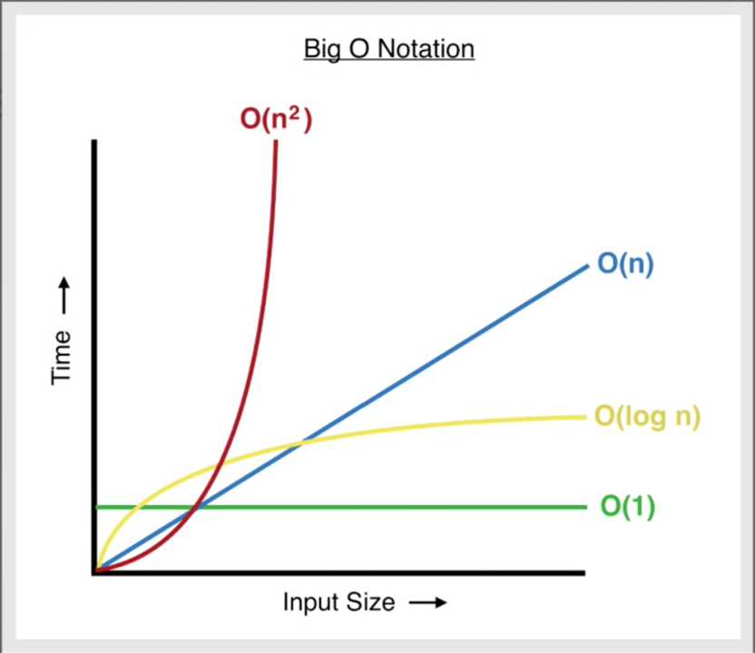

# **1.** Représentation interne des instructions et des données


## Base 2 et 10


1. **Base 10**

Pour convertir le binaire en valeur décimal il faut utiliser les puissances de 2.

La plus petite valeur est la plus à droite on l'appelle **bit de poids faible**.
La plus grande valeur est la plus à gauche on l'appelle **bit de poids fort**.

Valeur décimal 1234 :
` 1*10³ + 2*10² + 3*10¹ + 4*10⁰ = 1000 + 200 + 30 + 4 = 1234 `


2. **Base 2**

En **décimal** même principe avec les puissances de 10.

Valeur binaire 11 :
` 1*2¹ + 1*2⁰ = 2 + 1 = 3 `

> Une notation en **indice** (nombres en retrait en bas comme tel : $11_{(2)}=3_{(10)}$ ) est souvent utilisé pour indiquer les conversions


3. **Format 8 bits**

Exemple de valeur binaire codé sur 8 bits :
` 2⁷ + 2⁶ + 2⁵ + 2⁴ + 2³ + 2² + 2¹ + 2⁰ = 128 + 64 + 32 + 16 + 8 + 4 + 2 + 1 = 255 `

> Donc : $11111111_{(2)}=255_{(10)}$

Il y a 256 valeurs possibles dans 8 bits, de 0 à 255.
Nous pouvons aussi l'écrire de cette manière **2<sup>n</sup>**. <sup>n</sup> étant le nombre de bits contenus dans la valeur binaire.

> Il faut bien noter que la valeur **maximale** convertie en décimal est 2<sup>n</sup>-1


4. **Conversion d'un décimal ($\neq$ base 10) à la base 2**

- On divise successivement par 2, ensuite, avec les restes alignez les 0 et les 1 en partant du dernier reste obtenu vers le premier :
    - 183/2=91, reste 1;
    - 91/2=45, reste 1;
    - 45/2=22, reste 1;
    - 22/2=11, reste 0;
    - 11/2=5, reste 1;
    - 5/2=2, reste 1;
    - 2/2=1, reste 0;
    - 1/2=0, reste 1;

En partant du dernier résultat : 10110111

> Depuis les années 2000 les ordinateurs peuvent manipuler des nombres sur 64 bits = 2<sup>64</sup> = 18 446 744 073 709 551 616 soit plus de 18 milliards de milliards.

> L'idée d'utiliser 2 valeurs pour encoder d'autre valeurs remonte à **Francis Bacon** (1623).  Le "bilitère" composé de 2 lettres groupés par cinq : AAAAA = A, AAAAB = B, BABBB = Z. L'alphabet latin contenait 24 lettres (i = j et u = v).


## Les octets et les mots

1 octet = 8 bits (2⁸ = 256 valeurs).

> Pendant longtemps 256 valeurs suffisait à représenter les chiffres, lettres et symboles des alphabets occidentaux.

Avec les progrès informatiques certains microprocesseurs peuvent manipuler des valeurs atteignant jusqu'à 128 bits (16 octets) et plus. Ces valeurs devenant de plus en plus difficiles à décrire et à représenter, on parle maintenant de **mot** mémoire.

> Le bit est l'unité de mesure de l'information (0 ou 1), tandis que le mot (word en anglais) est l'unité de travail du CPU (processeur). On peut le voir comme **la taille de la main** du CPU.

Certains CPU font une différence entre divers types de mots (Par exemple les 68000 de Motorola utilisent des mots de 16 bits, et des mots longs (long word) de 32 bits).

!! Suivant le type de CPU l'ordre des mots est différent de l'ordre "logique". Par exemple sur un microprocesseur x86 en mode réel (16 bits), où, 1 mot = 16 bits = 2 octets, la valeur décimale 38457 (1001011000111001<sub>(2)</sub>), pour être stockés prend 2 octets ( Puisque > à 255 (1 octet) et < à 65 535 (2 octets) ) l'octet de poids faible (8 premiers bits), sera placé dans la première case mémoire et l'octet de poids fort ira à la case suivante (Idem pour 32 et 64 bits).

| **Case mémoire 1** | **Case mémoire 2** |
| :--- | :--- |
| 00111001 | 10010110 |


## L'hexadécimal

Si on reprend l'exemple d'une valeur de 64 bits en binaire il faut **64** 0 ou 1 pour la décrire. En décimal il en faut **20**. Ça prend de la place et c'est difficile à manipuler. C'est pour cela que l'on utilise en informatique une base hexadécimal<sub>(16)</sub> (de 0 à 9 puis de A(10) à F(15)).

- Donc:
    - 1 caractère hexadécimal (de 0 à F) représente exactement 4 bits (car 2⁴ = 16).
    - Pour 64 bits, on fait donc le calcul : 64/4 = 16.

| Décimal | Hexadécimal | Binaire |
| :--- | :--- | :--- |
| 0 | **0** | `0000` |
| 1 | **1** | `0001` |
| 2 | **2** | `0010` |
| 3 | **3** | `0011` |
| 4 | **4** | `0100` |
| 5 | **5** | `0101` |
| 6 | **6** | `0110` |
| 7 | **7** | `0111` |
| 8 | **8** | `1000` |
| 9 | **9** | `1001` |
| 10 | **A** | `1010` |
| 11 | **B** | `1011` |
| 12 | **C** | `1100` |
| 13 | **D** | `1101` |
| 14 | **E** | `1110` |
| 15 | **F** | `1111` |

> On utilise 0x en préfixe devant un hexadécimal pour ne pas confondre 10<sub>(10)</sub> et 10<sub>(16)</sub>. Exemple : 0x10 = 16.

### Conversion Décimal ↔ Hexadécimal

- **10 → 16 :** Diviser le nombre par 16 successivement et noter les restes de bas en haut (10=A, 11=B, etc.).
- **16 → 10 :** Multiplier chaque chiffre par $16^{position}$ (en partant de 0 à droite) et additionner les résultats.
- **Exemple 8C :** $(8 \times 16^1) + (12 \times 16^0) = 128 + 12 = 140$.

> À savoir, sur différentes machines et systèmes d'exploitations il est possible de voir différentes base que les trois vus.

# **2** L'algorithmique

## Programmer c'est un art

On peut voir la programmation comme de la cuisine. À moins d'avoir la science innée des mélanges (Ou d'avoir pratiqué pendant longtemps), vous aurez beau avoir les meilleurs instruments de cuisine/ordinateurs ou les meilleurs ingrédients/langages de programmation, sans recette/technique le résultat ne sera jamais délicieux/optimisé.

#### ***DÉFINITION** : Un **algorithme** est une suite d'instructions qui quand elles sont exécutées correctement aboutissent au résultat attendu.*

> L'algorithme est donc une recette pour qu'un ordinateur puisse donner un résultat souhaité.

> Le mot Algorithme vient d'Algoritmi, une latinisation du nom du mathématicien Al Khuwarizmi (IX siècle).

Un algorithme peut aussi bien être un texte (recette) qu'un dessin (organigramme), la méthode utilisé dépendra des besoins.

## La complexité algorithmique

Aussi appeler le "coût" d'un algorithme, la complexité de celui-ci est calculable.

On note la complexité d'un algorithme comme tel : O(f(n)).

- O est l'ordre
- f est une fonction (déterminé par l'algorithme) qui prend en paramètre n
- n est la quantité d'informations que l'algorithme traite

1. Recherche Linéaire, Complexité constante

Dans cet algorithme, on parcourt une liste pour trouver une valeur. Plus la liste est grande, plus le temps de calcul augmente de façon proportionnelle.

```php
// Ici n = la taille du tableau $liste
function f($liste) {
    $n = count($liste); 
    // L'algorithme détermine f : ici une simple boucle = f(n) = n
    foreach ($liste as $item) {
        echo $item;
    }
}
```

**Analyse :**
- Si le tableau a 10 éléments, on fait au maximum 10 comparaisons.
- Si le tableau a $n$ éléments, on fait au maximum $n$ comparaisons.
- **Notation :** On dit que cet algorithme est en **$O(n)$** (Complexité Linéaire).

---

2. Recherche de doublons, Complexité quadratique

Le temps d'exécution est proportionnel au carré de la taille des données d'entrée ($n \times n$). C'est très fréquent lorsqu'on utilise des boucles imbriquées (une boucle dans une boucle).

```php
<?php
// On compare chaque élément avec tous les autres
function trouverDoublons($tableau) {
    $n = count($tableau);
    // Première boucle
    for ($i = 0; $i < $n; $i++) {
        // Deuxième boucle imbriquée
        for ($j = $i + 1; $j < $n; $j++) {
            if ($tableau[$i] === $tableau[$j]) {
                return true; // Doublon trouvé !
            }
        }
    }
    return false; // Pas de doublon
}
?>
```

**Analyse :**
- Si le tableau a 10 éléments, on fait environ 100 comparaisons ($10^2$).
- Si le tableau a $n$ éléments, on fait $n \times n$ comparaisons.
- **Notation :** On dit que cet algorithme est en **$O(n^2)$** (Complexité Quadratique).


### Liste des complexités standards
Voici les classes de complexité les plus courantes, de la plus rapide à la plus lente :

| Notation | Nom |
| :--- | :--- |
| **$O(1)$** | **Constante** |
| **$O(\log(n))$** | **Logarithmique** |
| **$O(n)$** | **Linéaire** |
| **$O(n.\log(n))$** | **Quasi-linéaire** |
| **$O(n^2)$** | **Quadratique** |
| **$O(n^3)$** | **Cubique** |
| **$O(n^p)$** | **Polynomiale** |
| **$O(n^{(log(n))})$** | **Quasi-polynomiale** |
| **$O(n!)$** | **Factorielle** |
| **$O(2^n)$** | **Exponentielle** |

> **Note :** On s'intéresse toujours au **pire des cas** (quand l'élément cherché est à la toute fin ou absent).



#### FLOPS

Pour déterminer la puissance brute d'un CPU on utilise souvent le critère FLOPS.

**FLOPS** : FLoating-point Operations Per Second. Opérations à virgule flottante par seconde.

> Ex: Un Intel i9 14900K tourne à une moyenne de 1740 GFLOPS ( GigaFLOPS = 10⁹ FLOPS = 1 milliard d'opérations sur réels ( nombres à virgule ) par seconde )

Calculer des nombres entiers est très simple pour un processeur. Calculer avec des nombres réels (la "virgule flottante") est beaucoup plus complexe car il faut gérer la précision (le nombre de chiffres après la virgule), l'exposant (la puissance de 10 pour placer la virgule). Pour cela on utilise donc des **FPU** ( Floating Point Unit ).

> On retrouve les FLOPS dans le rendu 3D, l'entraînement de l'IA et les simulations scientifiques car toutes ces disciplines demandent des calculs de haute précision.

---

Pour mettre en perspective les différentes complexité algorithmique prenons un exemple de 20 données traités :
- O(n) : O(20). La vitesse de calcul est ridicule ( millionièmes de seconde )
- O(n!) : O(20!) = 2 432 902 008 176 640 000. Cela équivaut à 1 398 000 secondes soit 16 jours. La complexité O(n!) est la pire qui puisse exister.
- O(2<sup>n</sup>) : O(2<sup>20</sup>) = 1 048 576. 1 dixième de seconde pour celle-ci. Ce qui reste énorme est relativise la puissance des processeurs.

Il est donc important de comprendre la complexité algorithmique afin d'optimiser leurs utilisations.


## Qu'est-ce que l'algocratie ?

**Définition**, Algocratie: Système politique dans lequel des algorithmes influencent ou prennent activement part aux décisions publiques et à la vie politique de la société.

---

Collecter et analyser des données massives, évaluer des situations complexes, prédire des tendances futures, recommander des actions à entreprendre, les algorithmes nous entourent littéralement. en voici quelques exemples :
- Systèmes de recommandation en ligne : Amazon, Spotify, Youtube, Netflix, etc...
- Prises de décisions financières : Analyse de marchés, gestion de portefeuille, trading haute fréquence, etc...
- Santé et médecine : Diagnostique, aider la décision clinique, prédire des épidémies, etc...
- Surveillance et sécurité : Surveiller l'activité en ligne, détecter des menaces, prévenir la criminalité, etc...
- Gouvernance et politique : Analyse de données démographiques, présire les résultats électoraux, optimiser les politiques publiques, etc...

> Il est intéressant de noter qu'une bonne partie des utilisations décrites ci-dessus sont souvent cachés et/ou sur le fil (ou pas) de l'illégalité. Ce qui soulève beaucoup de questions éthiques, de transparence et de responsabilités quant à la conception et la mise en production de ceux-ci.

# **3** Les langages d'implémentation

## Quel langage est le plus optimisé ?

Nativement nos ordinateurs ne comprennent qu'un seul langage, le langage machine, dont voici un exemple en hexadécimal :

- B8 05 00 00 00   // Charger 5 dans le registre EAX
- 05 02 00 00 00   // Ajouter 2 à la valeur dans EAX

Explication :
- Les **OpCodes** : B8 et 05 sont des "codes d'opération". Le processeur sait que B8 signifie "déplacer une donnée dans EAX".
- Le **Little-Endian** : Tu as remarqué que le 5 est écrit 05 00 00 00 ? C'est parce que beaucoup de processeurs rangent les octets des nombres du plus petit au plus grand.

### L'abstraction

L'abstraction nous permet d'interpréter plus facilement le langage machine. On peut le voir comme des niveaux.

- Niveau 0 (Pas d'abstraction): `B8 05 00 00 00` Le processeur comprend, pour nous c'est plus compliqué.
- Niveau 1 (**Langage Assembleur**(Assembly)): `B8` devient `MOV` (Abréviation de Move), c'est l'assembleur qui traduit `MOV` en `B8`.
- Niveau 2 (Langage haut niveau type PHP): `$n = 5;`.

Important de noté que la liste ci-dessus est loin d'être exhaustive. Par exemple le **C** se logerait entre le niveau 1 et 2 que l'on a définit, il est plus haut niveau que l'**assembleur** mais plus bas niveaux que des langages interprétés comme le **PHP**.

**IMPORTANT**: En général un niveau d'abstraction bas signifie plus de possibilités et de contrôle sur le système. Les langages bas niveaux ne deviennent donc pas obsolètes avec l'arrivée de langages haut-niveau. D'autant plus que plus on descend de niveau d'abstraction au plus les performances du programme s'améliorent.

#### L'assembleur

Voici un petit exemple d'un "Hello World!" en assembleur x86 sous DOS (Disk Operating System, OS précédant Windows) :

```
Cseg segment                 ; Début du segment de code nommé "Cseg"
    assume cs:cseg, ds:cseg  ; On dit au processeur que le Code et les Données sont au même endroit
    org 100h                 ; On réserve 256 octets pour le système (standard DOS)

main proc                    ; Début de la procédure principale "main"
    jmp debut                ; Sauter par-dessus les données pour ne pas essayer de les exécuter !

    mess db 'Hello world!$'  ; Définition de la variable "mess" (db = define byte)
                             ; Le '$' est le caractère obligatoire de fin pour DOS.

debut:                       ; Étiquette (label) marquant le début réel du programme
    mov dx, offset mess      ; On place l'adresse mémoire du message dans le registre DX
    mov ah, 9                ; On prépare la fonction n°9 de DOS (Affichage de texte)
    int 21h                  ; Appel au système : "DOS, affiche ce qu'il y a dans DX !"

    ret                      ; "Return" : termine le programme proprement (rend la main au DOS)
main endp                    ; Fin de la procédure "main"

cseg ends                    ; Fin du segment de code
end main                     ; Point final du fichier avec indication du point d'entrée
```

#### Le C

Affichage d'un "Hello world!" en C :

```c
#include <stdio.h> // Inclut la bibliothèque standard pour pouvoir utiliser printf (Standard Input/Output)

/**
 * Point d'entrée du programme
 * argc : nombre d'arguments passés au programme
 * argv : tableau contenant les arguments (chaînes de caractères)
 */
int main(int argc, char **argv)
{
    // Affiche le message à l'écran. Le "\n" crée un saut de ligne.
    printf("Hello world!\n");

    // Retourne 0 au système d'exploitation pour dire que le programme s'est terminé sans erreur.
    return 0;
}
```

#### PHP

Affichage d'un "Hello world!" en PHP :

```php
<?php
print("Hello world!");
?>
```